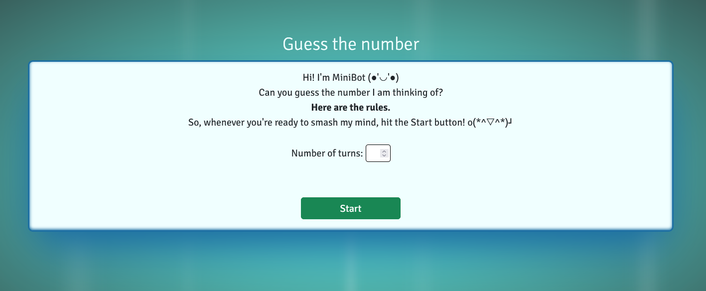
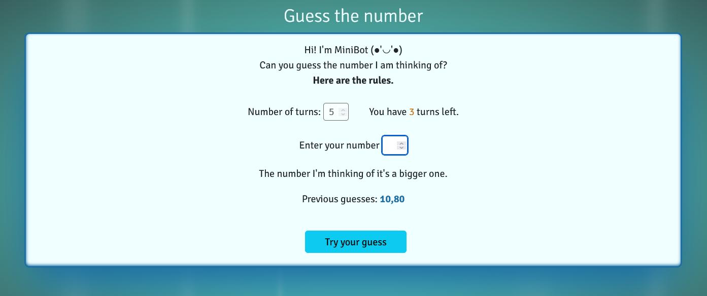
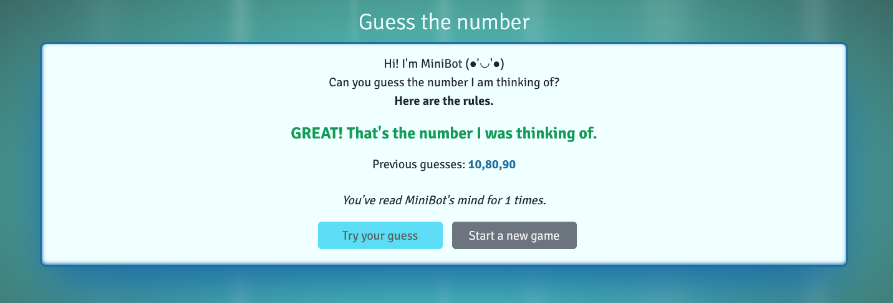
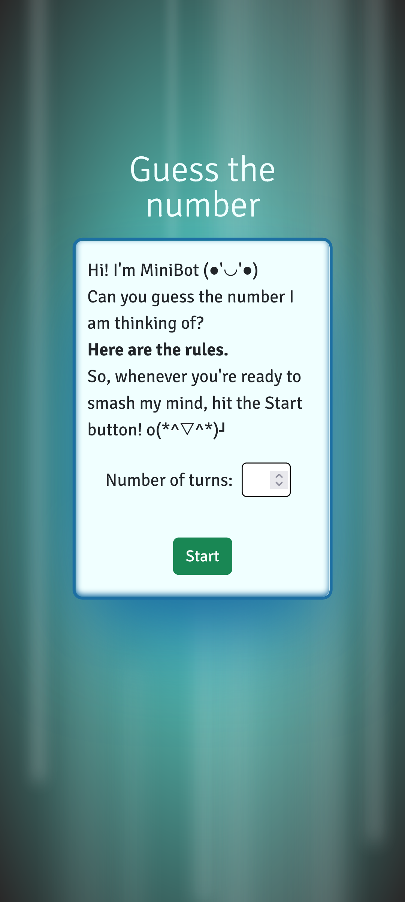

# Pixellab personal project - JavaScript Guess the number game

## Overview

This was the third personal project to make for the Pixellab's Frontend Web Development course, that I attended. It represents a browser game for two resolutions (desktop and mobile devices). This project was entirely implemented using Vanilla JavaScript programming language and Netlify to publish it online (https://legendary-dodol-ee81d1.netlify.app).
The website design was realized by me.

### The challenge

Users should be able to:

- View the optimal layout depending on their device's screen size.
- Start the game by clicking the "Start" button.
- Enter the desired number of turns.
- Insert some inputs.
- Receive intuitive messages to help them guess the number.
- Receive a win/lose message.

### Screenshot

HOMEPAGE

### Links

- Solution URL: [Github URL](https://github.com/PaulaDuduta/js-guess-the-number)
- Live Site URL: [Netlify homepage](https://legendary-dodol-ee81d1.netlify.app)

### Built with

- JavaScript
- Semantic HTML5 markup
- CSS custom properties
- Flexbox
- Mobile-first workflow
- Bootstrap

## Author

- GitHub - [@PaulaDuduta](https://github.com/PaulaDuduta)
